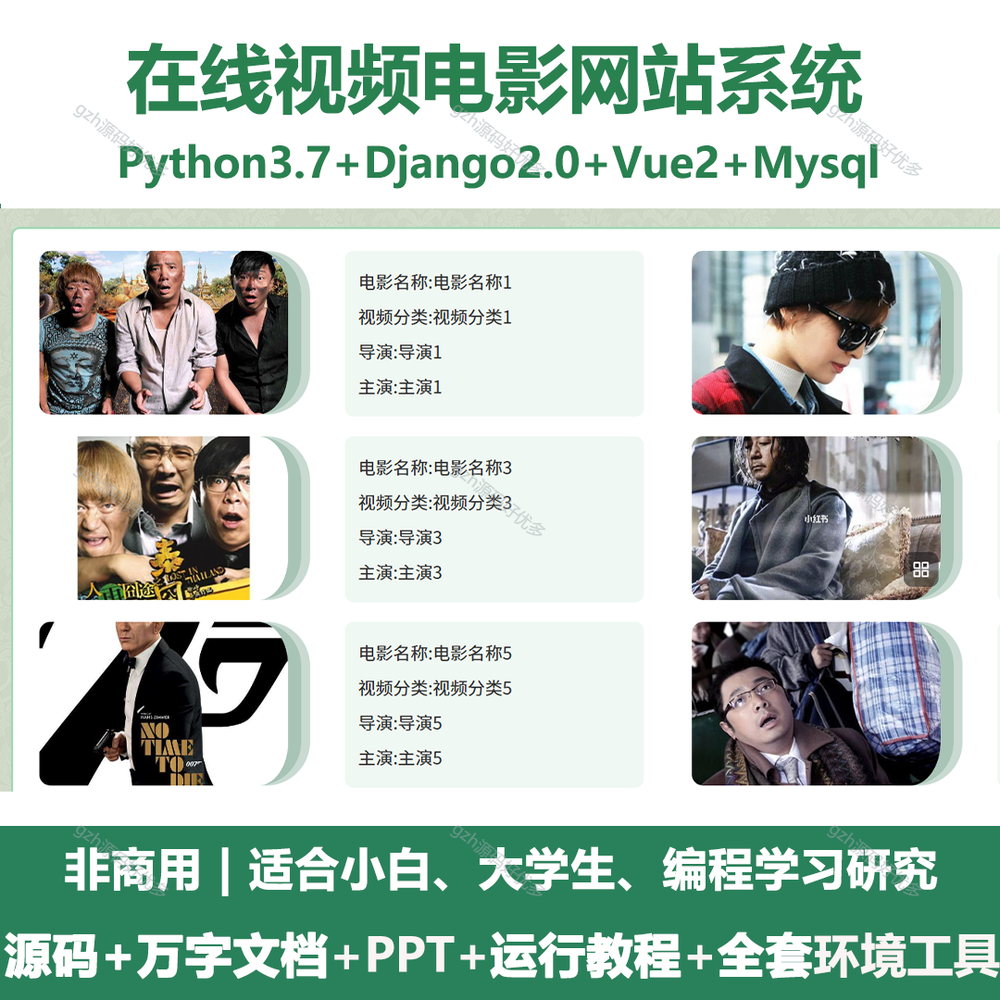
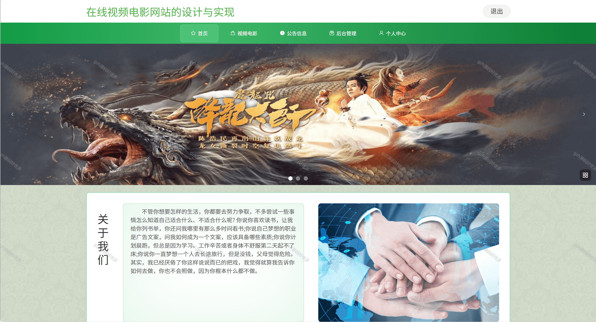
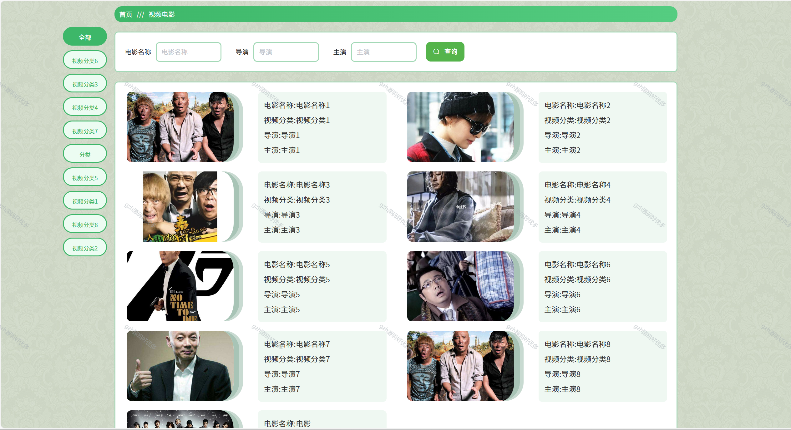
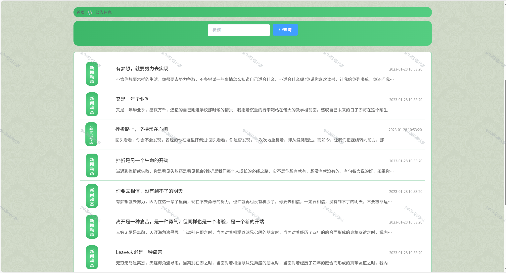
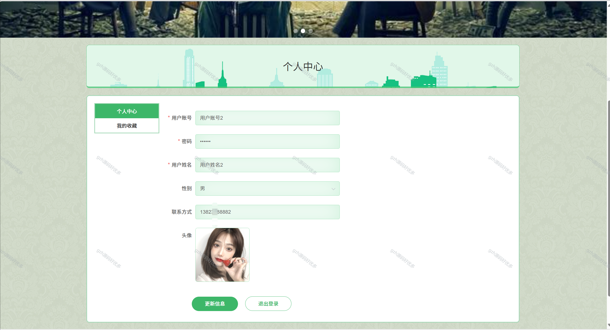
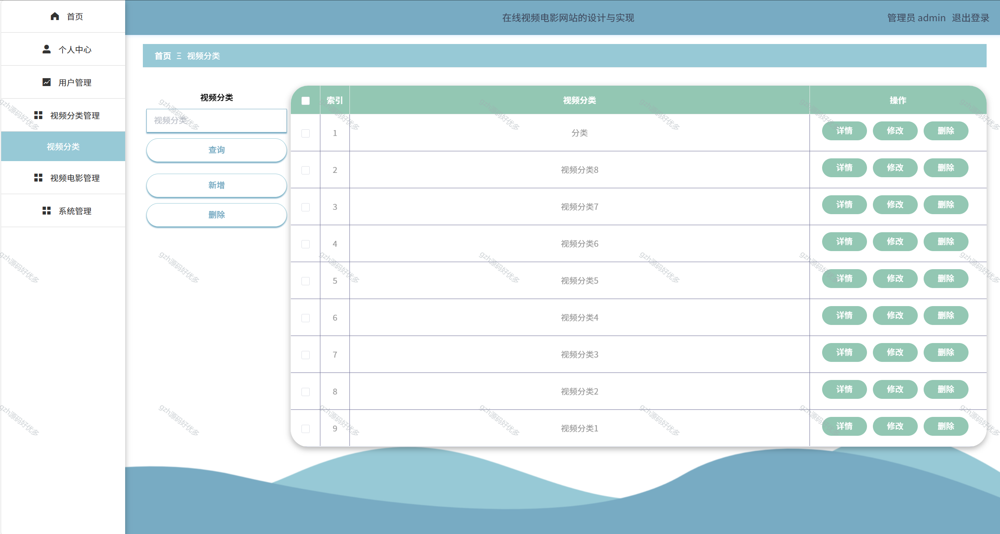
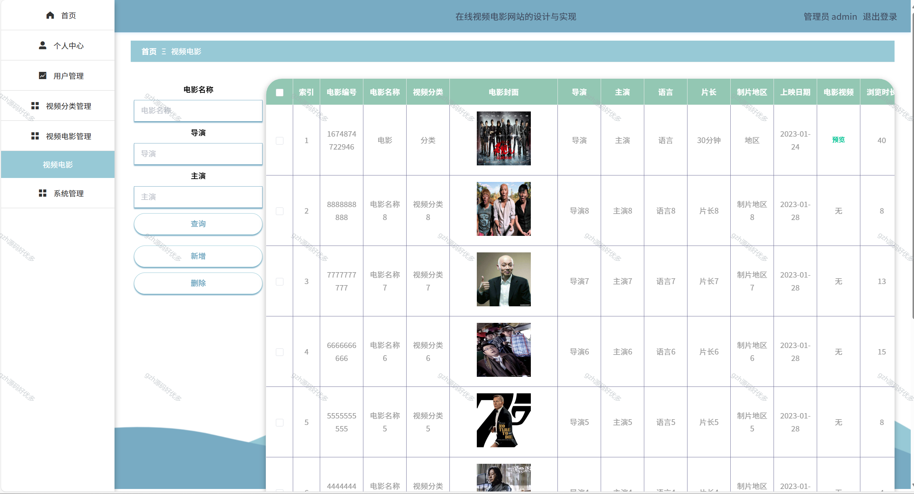
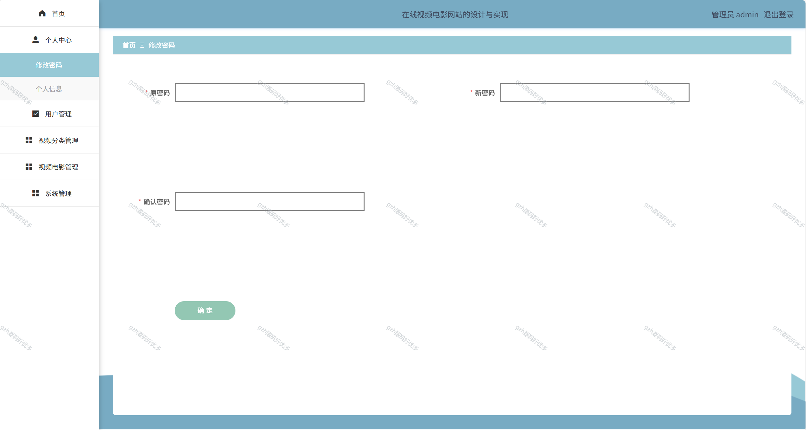
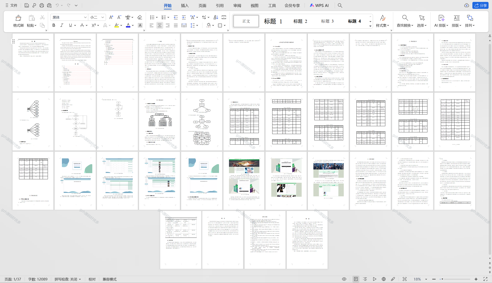

# python082
python082基于Python+Django的在线视频电影网站+LW+PPT
 
## 查看主页获取源码

### 一、关键词
在线电影视频网站系统，网络电影视频平台系统，在线电影视频平台

### 二、作品包含
源码+数据库+设计文档万字+PPT+全套环境和工具资源+本地部署教程

### 三、项目技术
前端技术：Vue2.0、Element-ui
后端技术：Python3.7、Django2.0

### 四、运行环境（以下版本亲测，其他版本兼容性请自行测试）
开发工具：PyCharm + VSCODE

数据库：MySQL5.7（最低要5.7版本）

数据库管理工具：Navicat10+

Python：Python3.7

前端Nodejs：14

浏览器：谷歌浏览器

### 五、项目介绍
项目编号：python082

在线视频电影网站系统设计的目的是为用户提供视频电影等方面的平台。
与其它应用程序相比，在线视频电影的设计主要面向于用户，旨在为管理员和用户提供一个在线视频电影网站。用户可以通过系统及时查看视频电影等。
此方式促进在线视频电影网站信息流动和数据传输效率，提供一个内容丰富、功能多样、易于操作的在线视频电影网站。

### 六、运行截图

